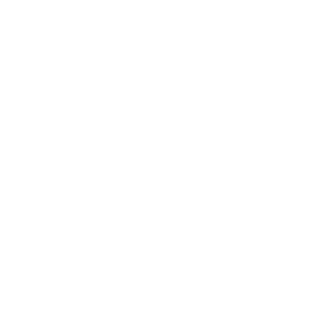

# Chirpie

> Random side project

Simple Twitter clone

## Stack

| What           | Using                  |
| -------------- | ---------------------- |
| Frontend       | React, TypeScript, CSS |
| Backend        | Rust                   |
| Database       | MongoDB                |
| Authentication | Auth0                  |

## Backend API

### Get User Profile

```http
GET /api/profiles/:name
```

```json
200 OK

{
    "id": "",
    "name": "Example User",
    "image": "SOME_IMAGE_URL",
}
```

### Get User Chirps

```http
GET /api/chirps/:id
```

### Get Specific User Chirp

```http
GET /api/profiles/:name
```
